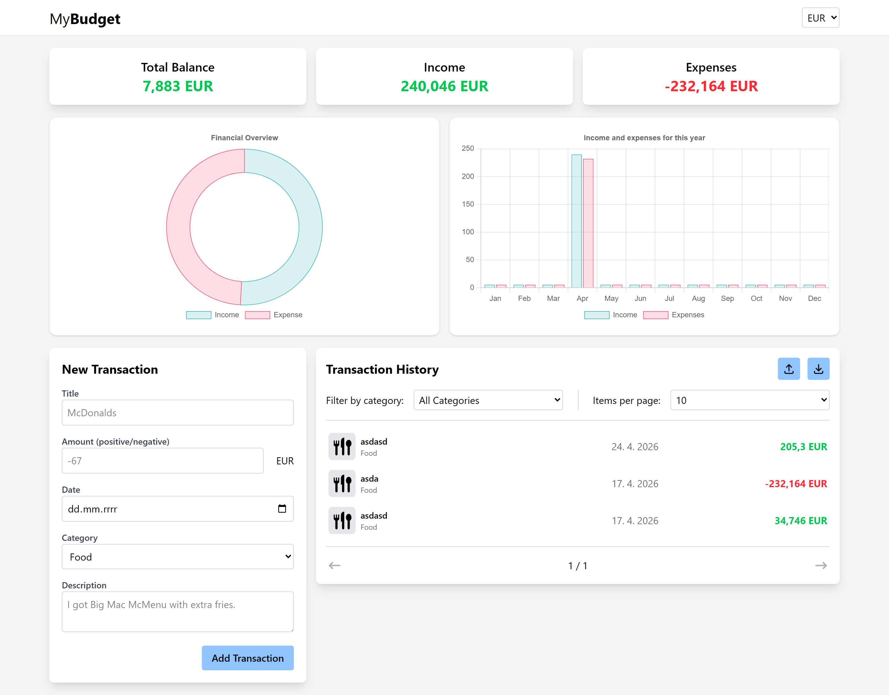

# MyBudget

A web application for managing personal finances.

**[Try it now!](https://petlukdev.github.io/MyBudget/)**

## 🗃️ Tech stack

## ⚙️ Features

- Adding, editing, and deleting user transactions
- Automatic chart updates
- Saving transactions to local storage
- Choice of 3 currencies (CZK, EUR, USD)
- Filtering by transaction category
- Option to set a maximum limit for the number of items displayed per page
- Option to export and import transactions to/from local storage in JSON format
